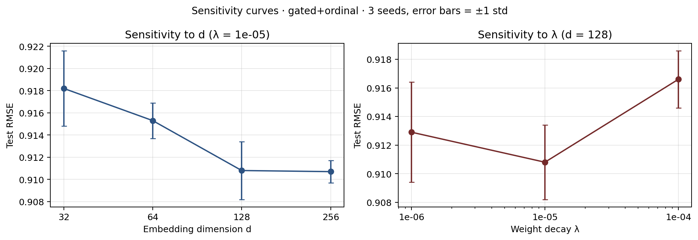

# 2026-04-26_sensitivity

Defaults: d=128, λ=1e-05

## Sweep grid

| d | λ | RMSE | MAE | Accuracy | NLL |
|---|---|---|---|---|---|
| 32 | 1e-05 | 0.9182 ± 0.0034 | 0.7165 ± 0.0014 | 0.4372 ± 0.0013 | 1.2583 ± 0.0044 |
| 64 | 1e-05 | 0.9153 ± 0.0016 | 0.7136 ± 0.0015 | **0.4385 ± 0.0002** | 1.2548 ± 0.0038 |
| 128 | 1e-06 | 0.9129 ± 0.0035 | 0.7120 ± 0.0015 | 0.4385 ± 0.0009 | 1.2523 ± 0.0062 |
| 128 | 1e-05 | 0.9108 ± 0.0026 | **0.7119 ± 0.0020** | 0.4368 ± 0.0026 | 1.2515 ± 0.0059 |
| 128 | 1e-04 | 0.9166 ± 0.0020 | 0.7173 ± 0.0008 | 0.4341 ± 0.0033 | 1.2588 ± 0.0034 |
| 256 | 1e-05 | **0.9107 ± 0.0010** | 0.7122 ± 0.0008 | 0.4380 ± 0.0029 | **1.2479 ± 0.0015** |

Bold = best per column (RMSE/MAE/NLL min; Acc max).
Variance: 3 seeds {42, 43, 44}.
Protocol: gated+ordinal, ablation patience=10, max 30 epochs.

Raw: `sensitivity_summary.csv` · per-run JSONs: `d<d>_lam<λ>_seed<N>/results.json`
