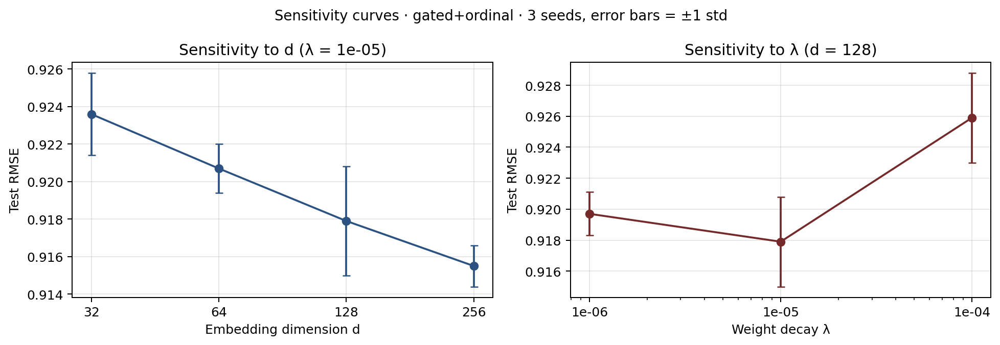

# 2026-04-27_sensitivity_v2

Defaults: d=128, λ=1e-05

## Sweep grid

| d | λ | RMSE | MAE | Accuracy | NLL |
|---|---|---|---|---|---|
| 32 | 1e-05 | 0.9236 ± 0.0022 | 0.7202 ± 0.0006 | 0.4356 ± 0.0011 | 1.2651 ± 0.0004 |
| 64 | 1e-05 | 0.9207 ± 0.0013 | 0.7189 ± 0.0013 | **0.4366 ± 0.0022** | 1.2591 ± 0.0014 |
| 128 | 1e-06 | 0.9197 ± 0.0014 | 0.7187 ± 0.0022 | 0.4344 ± 0.0008 | 1.2576 ± 0.0042 |
| 128 | 1e-05 | 0.9179 ± 0.0029 | 0.7182 ± 0.0032 | 0.4335 ± 0.0014 | 1.2560 ± 0.0007 |
| 128 | 1e-04 | 0.9259 ± 0.0029 | 0.7267 ± 0.0015 | 0.4254 ± 0.0012 | 1.2656 ± 0.0028 |
| 256 | 1e-05 | **0.9155 ± 0.0011** | **0.7165 ± 0.0025** | 0.4333 ± 0.0047 | **1.2525 ± 0.0003** |

Bold = best per column (RMSE/MAE/NLL min; Acc max).
Variance: 3 seeds {42, 43, 44}.
Protocol: gated+ordinal, ablation patience=10, max 30 epochs.

Raw: `sensitivity_summary.csv` · per-run JSONs: `d<d>_lam<λ>_seed<N>/results.json`
